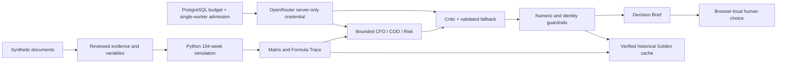

# Architecture

```mermaid
flowchart LR
 A[Synthetic documents] --> B[Reviewed evidence and variables]
 B --> C[Python 104-week simulation]
 C --> D[Matrix and Formula Trace]
 D --> E[Bounded CFO / COO / Risk]
 E --> F[Critic + validated fallback]
 F --> G[Numeric and identity guardrails]
 G --> H[Decision Brief]
 H --> I[Browser-local human choice]
 D --> J[Verified historical Golden cache]
 G --> J
 K[OpenRouter server-only credential] --> E
 K --> F
 L[PostgreSQL budget + single-worker admission] --> K
```

AI failure leaves D available. Cached replay is read-only. DataVersion/simulationId/scenario/requestId bind downstream stages. Frontend never receives the credential.
